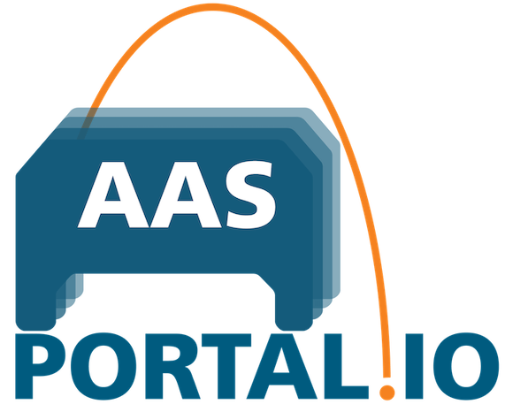
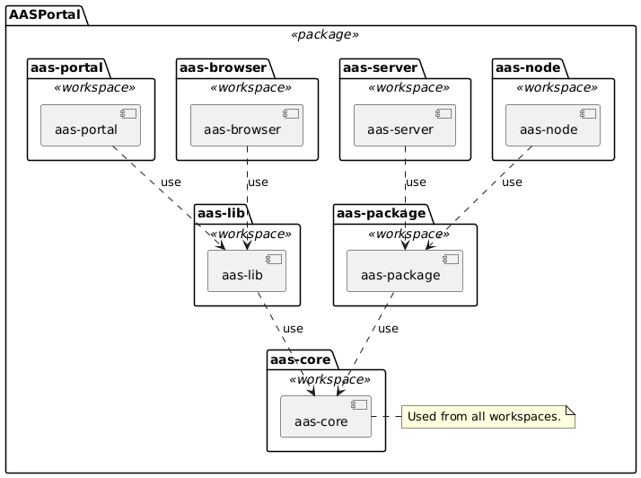

# AASPortal [](https://aasportal.readthedocs.io/en/latest/?badge=latest)



**AASPortal** is a Node.js based web portal for the visualization and management of Asset Administration Shells (AAS). The implementation uses the concepts of the document "Details of the Asset Administration Shell" published on https://www.plattform-i40.de and licensed under Creative Commons CC BY 4.0. 
Check out the [Getting Started](./read-the-docs/source/gettingstarted.md) section to learn how to setup Visual Studio Code and start using and developing the *AASPortal*. Learn more about the [Architecture](./read-the-docs/source/architecture.md) of *AASPortal*, and check out the [Usage](./read-the-docs/source/usage.md) section to learn about available search filters for AAS and which Endpoints can be connected to the *AASPortal*.

For more details about the AASPortal see the full documentation :blue_book: [here](https://aasportal.readthedocs.io/en/latest/?badge=latest).
**AASPortal is under active development and we are looking forward to your active contributions!**

## Prerequisites
<<<<<<< HEAD
- **Node.js v22.12.0** (required for development)
=======
- **Node.js v22.16.0** (required for development)
>>>>>>> development
- **Visual Studio Code** (recommended IDE)
- **Docker Desktop 4.x OR Podman Desktop** (for containerized development)
- **Git** (for version control)

## Getting Started
You can find a detailed documentation :blue_book: [here](https://aasportal.readthedocs.io/)

### Using Docker/Podman (Easiest)

Run the all-in-one image from DockerHub:
```bash
# Docker
docker run -p 80:80 fraunhoferiosb/aasportal_aio

# Podman
podman run -p 80:80 docker.io/fraunhoferiosb/aasportal_aio
```

Then open http://localhost/ in your browser.

### Local Development Setup

1. **Clone the repository:**
   ```bash
<<<<<<< HEAD
   git clone https://github.com/FraunhoferIOSB/AASPortal.git
=======
   git clone https://github.com/eclipse-aasportal/AASPortal.git
>>>>>>> development
   cd AASPortal
   ```

2. **Install dependencies:**
   ```bash
   npm install
   ```

3. **Build all workspaces:**
   ```bash
   npm run build -ws
   ```

4. **Start the development server:**
   ```bash
   npm run serve
   ```

5. **Open http://localhost/ in your browser**

## Workspace Architecture

<<<<<<< HEAD
AASPortal is a **monorepo** using npm workspaces with 5 distinct packages:

| Workspace | Description | Technology Stack |
|-----------|-------------|------------------|
| **aas-core** | Shared types, utilities, and AAS data models | TypeScript, ESM |
| **aas-portal** | Angular frontend application | Angular 20.1.6, NgRx, Bootstrap 5 |
| **aas-node** | Express.js backend API server | Express.js, JWT, OpenAPI/Swagger |
| **aas-lib** | Reusable Angular UI components | Angular Library, ng-bootstrap |
| **aas-jest** | Custom Jest configuration utilities | Jest, TypeScript |
=======
AASPortal is a **monorepo** using npm workspaces with the following distinct packages:



The technology stack for the entire project is: Typescript, ESM (ECMAScript modules) and Jest as test framework.

| Workspace       | Description| Technology Stack |
|-----------------|------------|------------------|
| **aas-core**    | Provides platform neutral type definitions, AAS data models and utility functions. | TypeScript, AAS core 3.0 |
| **aas-package** | Node.js library for reading and writing AASX package files (JSON/XML, V1/V2/V3 support). | TypeScript, JSZip, xpath |
| **aas-node**    | The AASPortal backend server application. | Express.js, OpenAPI/Swagger (TSOA), WebDav-Client |
| **aas-lib**     | Reusable Angular UI components and services for AAS applications. | Angular 20.x, Bootstrap 5 |
| **aas-portal**  | The AASPortal Web application for AAS visualization and management. | Angular 20.x, Bootstrap 5, NgRx |
| **aas-server**  | An AAS server application with an API that is conform to the IDTA Part 2 specification. | Node.js, Express.js, OpenAPI/Swagger (TSOA) |
| **aas-browser** | Front-end application for the AASServer for browsing its content. | Angular 20.x, Bootstrap 5 |
>>>>>>> development

## Development Commands

### Building
```bash
npm run build                 # Build all workspaces (production)
npm run build:debug           # Build all workspaces (development)
npm run lib:build             # Build only aas-core and aas-lib
npm run aas-portal:build      # Build frontend dependencies + aas-portal
npm run aas-node:build        # Build backend dependencies + aas-node
```

### Testing
```bash
npm run test                  # Run tests in all workspaces
npm run test -w aas-core      # Run tests for specific workspace
npm run coverage              # Generate coverage reports
```

### Code Quality
```bash
<<<<<<< HEAD
npm run lint                  # Lint all workspaces
=======
npm run lint                 # Lint all workspaces
>>>>>>> development
npm run format               # Format all workspaces
npm run lint -w aas-portal   # Lint specific workspace
```

### Container Development

**Docker:**
```bash
npm run start              # Build and run complete Docker setup
npm run user-db            # Start MongoDB for user storage
npm run compose:up         # Full multi-service setup
```

**Podman:**
```bash
npm run start:podman       # Build and run complete Podman setup
npm run user-db:podman     # Start MongoDB for user storage
npm run compose:up:podman  # Full multi-service setup
```

<<<<<<< HEAD
=======
### Kubernetes Deployment

For production deployments in Kubernetes, AASPortal supports:
-  Standard root path deployment (`/`)
-  Sub-path deployment (e.g., `/aasportal/`) via `BASE_HREF` environment variable
-  Ingress configuration with path rewriting
-  High availability with horizontal pod autoscaling

**Quick example:**
```yaml
apiVersion: apps/v1
kind: Deployment
metadata:
  name: aas-portal
spec:
  containers:
  - name: aas-portal
    image: fraunhoferiosb/aasportal:latest
    env:
    - name: BASE_HREF
      value: "/aasportal/"  # Deploy under sub-path
```

📘 **See the [Kubernetes Deployment Guide](./read-the-docs/source/kubernetes.md) for:**
- Complete deployment manifests
- Ingress configuration examples
- Environment variables reference
- High availability setup
- Monitoring and troubleshooting

>>>>>>> development
## Troubleshooting

### Container Networking Issues

When adding AAS endpoints that run on the host machine (localhost), remember that containers have isolated networking:

**❌ Problem**: `http://localhost:5001` fails with "invalid or not supported AAS endpoint"

**✅ Solution**: Use container-to-host networking:
- **Podman**: `http://host.containers.internal:5001`
- **Docker**: `http://host.docker.internal:5001`
- **Alternative**: Use the host's actual IP address instead of localhost

**Example endpoint URLs for containerized AASPortal:**
```bash
# ✅ Correct
http://host.containers.internal:5001       # Podman
http://host.docker.internal:5001           # Docker
http://192.168.1.100:5001                  # Host IP

# ❌ Wrong
http://localhost:5001                       # Container's localhost
http://127.0.0.1:5001                      # Container's loopback
```

### Common Development Issues

<<<<<<< HEAD
**Build fails**: Ensure Node.js v22.12.0 is installed
```bash
node --version  # Should output v22.12.0
=======
**Build fails**: Ensure Node.js v22.16.0 is installed
```bash
node --version  # Should output v22.16.0
>>>>>>> development
```

**Tests fail**: Run tests individually to isolate issues
```bash
npm run test -w aas-core -- --verbose
```

**Linting errors**: Auto-fix most issues
```bash
npm run format  # Auto-format code
npm run lint -- --fix  # Auto-fix linting issues
```

## Changelog

You can find the detailed changelog [here](read-the-docs/source/changelog/changelog.md).

## Contributors

| Name                | Github Account                                              |
| :------------------ | ----------------------------------------------------------- |
| Ralf Aron           | [ralfaron](https://github.com/ralfaron)                     |
| Alexander Wollbrink | [AlexanderWollbrink](https://github.com/AlexanderWollbrink) |
| Juilee Tikekar      | [juileetikekar](https://github.com/juileetikekar)           |
| Florian Pethig      | [fpethig](https://github.com/fpethig)                       |

## Contact

aasportal@iosb-ina.fraunhofer.de

## License

Distributed under the Apache 2.0 License. See `LICENSE` for more information.

Copyright (C) 2019-2025, Fraunhofer IOSB-INA Lemgo, eine rechtlich nicht selbstaendige Einrichtung der Fraunhofer-Gesellschaft zur Foerderung der angewandten Forschung e.V., Germany

You should have received a copy of the Apache 2.0 License along with this program. If not, see https://www.apache.org/licenses/LICENSE-2.0.html.
