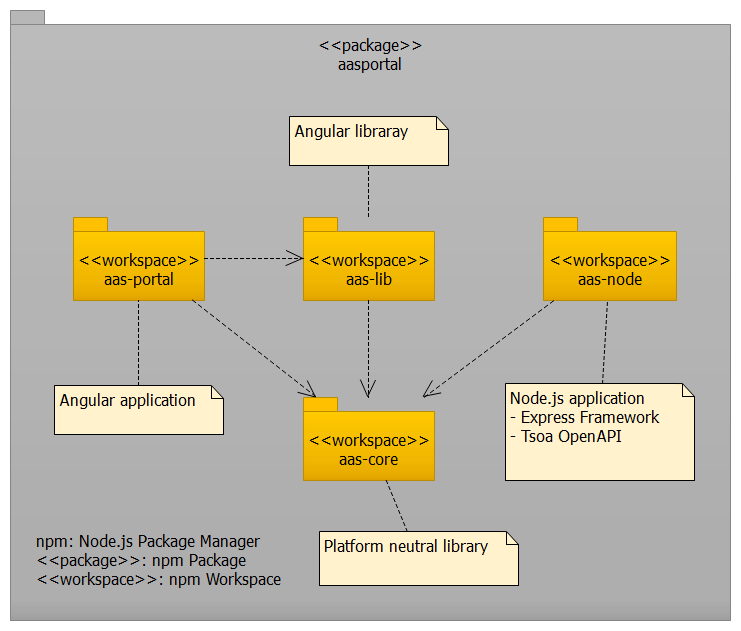
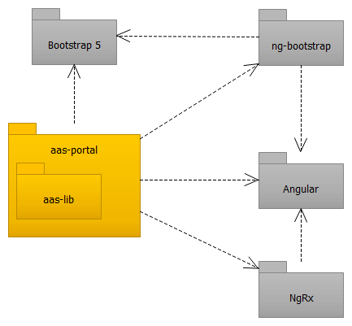

# Architecture and Design
<<<<<<< HEAD
## Workspace Architecture

AASPortal is a **monorepo** using npm workspaces with 5 distinct packages:

| Workspace | Description | Technology Stack |
|-----------|-------------|------------------|
| **aas-core** | Shared types, utilities, and AAS data models | TypeScript, ESM |
| **aas-portal** | Angular frontend application | Angular 19, NgRx, Bootstrap 5 |
| **aas-node** | Express.js backend API server | Express.js, JWT, OpenAPI/Swagger |
| **aas-lib** | Reusable Angular UI components | Angular Library, ng-bootstrap |
| **aas-jest** | Custom Jest configuration utilities | Jest, TypeScript |

aas-jest is missing in image!

## AASPortal
AASPortal is an Angular based WEB application. The UI is implemented with the Bootstrap 5 frontend toolkit in conjunction with Bootstrap widgets (ng-bootstrap). For managing the global and local state of the application the NgRx framework is used.

## AASNode
AASNode is a Node.js WEB application. The REST API provided by AASNode is realized with the WEB framework *Express*. For authentication the concept JSON Web Tokens is used. The implementation uses the module *jsonwebtoken*. The AASNode provides an OpenAPI-compliant REST API. To create the living documentation of the REST API the module *swagger-ui-express* is used.

For the access to Asset Administration Shells in an OPC UA server the *node-opcua* framework is used.

=======

## Workspace Architecture

AASPortal is a **monorepo** using npm workspaces with the following distinct packages:

For detailed information about each workspace, see the [Workspace Documentation](workspaces.md).

## AASPortal (Frontend)

**aas-portal** is an Angular-based web application for visualizing and managing Asset Administration Shells.

**Key Technologies:**
- **Angular 20.x**: Modern reactive framework with signals support
- **NgRx**: State management for predictable application state
- **Bootstrap 5**: Responsive UI with ng-bootstrap components
- **Chart.js**: Data visualization capabilities
- **i18n**: Multi-language support via ngx-translate

**Architecture:**
- Component-based architecture with lazy loading
- Reactive state management with NgRx Store
- OnPush change detection for performance
- Service layer for API communication

## AASNode (Backend)

**aas-node** is a Node.js/Express.js backend server that provides a unified REST API for accessing Asset Administration Shells from multiple sources.

**Key Technologies:**
- **Express.js**: Fast, minimalist web framework
- **JWT (jsonwebtoken)**: Token-based authentication (HS256/RS256)
- **OpenAPI/Swagger**: Auto-generated API documentation via TSOA and swagger-ui-express
- **node-opcua**: OPC UA server connectivity for industrial assets
- **MongoDB**: User storage
- **WebDAV Client**: Remote file system access

**Features:**
- Multi-source AAS providers (file system, OPC UA, AASX Server, AAS Registry)
- Background scanning and indexing of AAS containers
- Real-time data subscriptions
- Template management for AAS creation
- AASX package handling via aas-package library

## AASServer

**aas-server** is a standalone AAS repository server with an IDTA Part 2 compliant API.

**Key Technologies:**
- **Express.js**: Web framework
- **OpenAPI/Swagger**: Standards-compliant API documentation via TSOA
- **aas-package**: AASX file handling

**Features:**
- IDTA specification Part 2 compliant REST API
- Asset Administration Shell repository
- Submodel repository
- Concept description repository
>>>>>>> development
